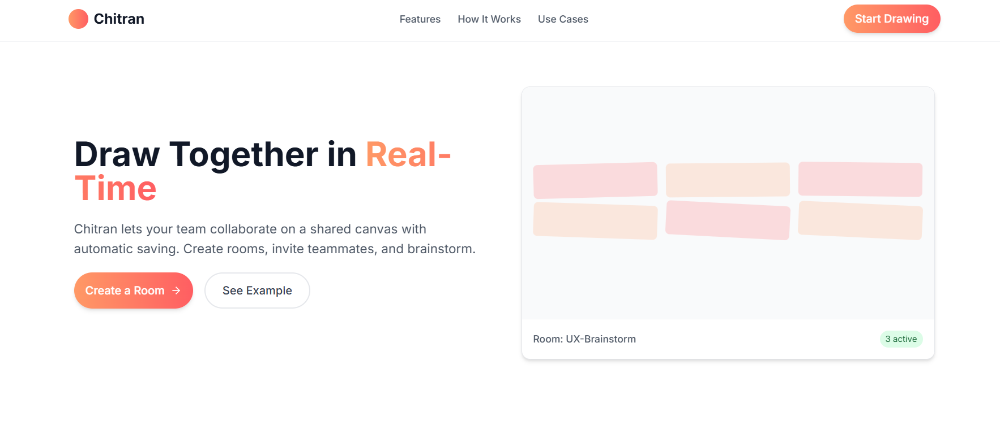
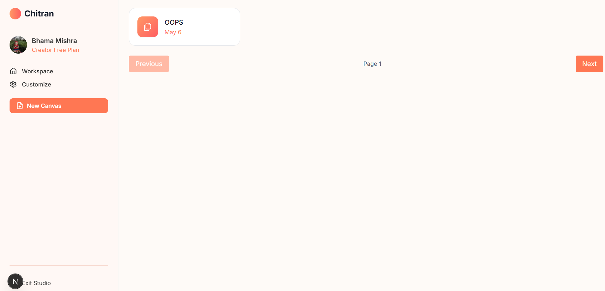
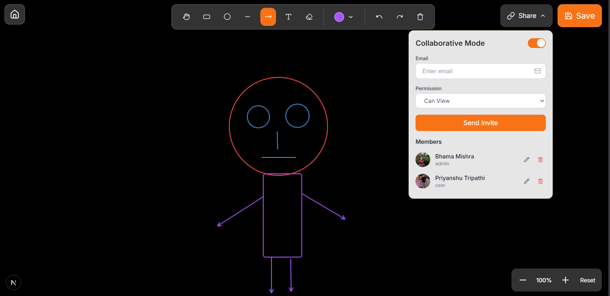

# Chitran – Sketch. Create. Inspire.

**Chitran** is a real-time collaborative drawing platform that allows users to draw shapes, write text, erase, undo, redo, and customize fonts and colors all on a shared canvas with full synchronization.

What makes Chitran different isn't just the ability to draw - it’s the robust **real-time collaboration**, **role-based control**, and **scalable system architecture** built with production-level patterns and tooling.

---

## Core Features

* **Multi-Shape Drawing**: Draw rectangles, circles, arrows, and insert text with adjustable font, color, and size.
* **Precise Erasing**: Erase individual shapes based on coordinate detection.
* **Undo / Redo**: Powerful stack-based undo/redo system for seamless control.
* **Live Collaboration**: Real-time drawing sync powered by a custom Redis Pub/Sub architecture.
* **Admin Controls**:

  * Grant or revoke editing rights.
  * Toggle collaboration on/off at any time.
* **Persistent Canvas Storage**: Each stroke and shape is stored in PostgreSQL for long-term access.
* **Scalable State Management**: Uses Redux Toolkit and React Query to ensure minimal latency and fast updates.
* **Turborepo Architecture**: A modular monorepo setup for optimal scalability and code sharing.

---

## Tech Stack

| Layer        | Tools & Libraries                                                         |
| ------------ | ------------------------------------------------------------------------- |
| **Frontend** | Next.js (App Router), Tailwind CSS, Shadcn UI, Redux Toolkit, React Query |
| **Backend**  | Express.js, Socket.IO                                                     |
| **Database** | PostgreSQL                                                                |
| **Caching**  | Redis                                                                     |
| **Patterns** | Singleton Pattern, Pub/Sub for real-time updates                          |
| **Monorepo** | Turborepo (with apps + shared packages)                                   |

---

## Architecture Highlights

* **Zod + TypeScript** – Enforces type safety and runtime validation across services.
* **Singleton Pattern** – Guarantees a single active WebSocket instance per session to avoid message duplication.
* **Redis Pub/Sub** – Decouples message flow for scalable real-time collaboration on canvases.
* **Turborepo Structure** – Separates concerns into apps (`web`, `server`, `ws-server`) and shared logic, making the project team- and microservice-ready.

---

## Project Structure

```
/apps
  └── web         # Frontend with canvas UI and drawing logic
  └── server      # Express API handling roles, DB interaction
  └── ws-server   # WebSocket server using Socket.IO for real-time sync

/packages
  └── backend-common      # Things common in backend
  └── database            # Prisma is initialized here
  └── common              # Things common in whole project

```

---

<h2>🖼️ Preview</h2>

<table>
  <tr>
    <td align="center">
      
      <br />
      <sub><b>Home Screen</b></sub>
    </td>
    <td align="center">
      
      <br />
      <sub><b>Dashboard View</b></sub>
    </td>
    <td align="center">
      
      <br />
      <sub><b>Canvas Editor</b></sub>
    </td>
  </tr>
</table>


---

##  Why Chitran?

Most collaborative drawing tools are either too minimal or too complex. **Chitran strikes a balance**:

* Clean, fast UI with **modern drawing tools**
* **Role-based access control** for security and collaboration
* **True real-time sync** with Redis Pub/Sub
* **Modular, maintainable codebase** built for scale and team workflows
* Optimistic updates and **state reconciliation** to ensure a consistent experience across all users

---

## Roadmap

* [ ] Version history with granular undo/redo
* [ ] Real-time cursor tracking
* [ ] Export canvas as image / PDF
* [ ] Auto-save with intelligent throttling
* [ ] Canvas-level chat
* [ ] Multi-tab sync with activity indicators

---

## Live Demo

Deployment is currently being configured with rate-limiting, security headers, and performance profiling.
-> A working video demo is available [on Youtube](#) (link to be inserted).

---

## For Contributors

Chitran isn’t just a drawing tool — it’s a **real-world system design playground**.
Open to contributions in:

* WebSocket performance & scaling
* Canvas optimizations
* UI/UX enhancements
* Infrastructure improvements
* Redis or PostgreSQL query optimization

---

## Inspiration

> The name **Chitran** comes from the Sanskrit word *चित्रण*, meaning *drawing* or *sketching*.
> It reflects the core philosophy — that every brilliant idea starts with a blank canvas.


